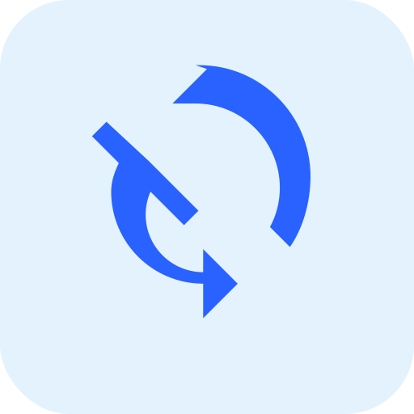

<p align="center">
	
</p>

# OneDrive to Google Photos Sync (Android)

A minimal foreground-service + WorkManager scaffold. It now includes OAuth scaffolding and placeholder clients for OneDrive (list/delete) and Google uploads. Next we’ll wire real OAuth and the full sync pipeline.

## Build locally (Windows)

1. Install Android Studio (SDK 34, Build-Tools 34.x, Platform Tools, cmdline-tools) and JDK 17.
2. Ensure `local.properties` exists with your SDK path, for example:

```
sdk.dir=C:\\Users\\<you>\\AppData\\Local\\Android\\Sdk
```

3. Build:

```
./gradlew assembleDebug -x lint
```

APK: `app/build/outputs/apk/debug/app-debug.apk`

## Build via GitHub Actions

Push to `main` or trigger the workflow manually. The debug APK is uploaded as an artifact named `app-debug-apk`.

On tags matching `v*`, a GitHub Release is created and the APK(s) are attached. If signing secrets are configured, a signed `app-release.apk` is also attached.

## How to use the app

Follow these steps on your Android device (Pixel recommended):

1) Install the APK
- Download the latest APK from GitHub Releases (on a tag like `v0.x.y`).
- If prompted, allow installing from unknown sources.

2) First-run setup (once)
- Open the app.
- Tap Grant Permissions to allow network access; on Android 10 and below you may also be asked for storage permissions.
- Tap Battery Optimization Settings and exempt the app so background sync is reliable.

3) Sign in to your accounts (once)
- Tap Sign in to OneDrive and complete Microsoft sign-in. Once successful, tokens are cached and future background runs use silent refresh.
- Tap Sign in to Google Photos and complete sign-in. You must configure the correct Google OAuth client ID and redirect URI inside the app first (see Configuration below).

4) Pick local folder for deletions (optional but recommended)
- Tap Pick Local Folder (SAF) and choose the folder that contains your camera photos/videos (e.g., DCIM/Camera). This lets the app delete local files after they’re safely uploaded to Google Photos and removed from OneDrive.

5) Start background sync
- Tap Start Background Sync. A persistent notification will show that the service is running.
- WorkManager will run a sync roughly every 15 minutes (Android enforces minimum intervals and may batch runs to save battery).

6) Monitor status
- The main screen shows:
	- OneDrive: Signed in / Signed out
	- Google: Signed in / Signed out
	- Last sync: timestamp with counts (success and total processed in the last cycle)

Behavior
- On each cycle, the app attempts to list new media from OneDrive Camera Roll, download items, upload to Google Photos, delete the file from OneDrive, and then best‑effort delete the matching local file (within the SAF-picked folder).
- If either account isn’t signed in or tokens can’t be refreshed silently, the cycle is skipped without crashing and will try again next time.

Notes
- OneDrive interactive sign-in is needed once; after that, silent tokens should work in the worker.
- Google OAuth uses AppAuth with PKCE. You must supply a real client ID and redirect URI to sign in successfully.
- Local filename mapping currently uses filename only under the selected folder. If your device stores photos in nested folders or with different names, we can extend this logic.

## Configuration

Before Google sign-in will work, update these values in the app:

- `app/src/main/res/values/strings.xml`
	- `google_client_id`: your Google OAuth Android client ID
	- `google_redirect_uri`: your redirect, e.g., `onedrivephotosync://auth`

- `app/src/main/res/raw/msal_config.json`
	- `client_id`: your Azure App Registration client ID
	- `redirect_uri`: must match the same scheme you configured in the app and in Azure (defaults to `onedrivephotosync://auth`)
	- Authorities/audience: leave as default unless you use a specific tenant.

- `app/build.gradle`
	- `defaultConfig.manifestPlaceholders.appAuthRedirectScheme`: app scheme (defaults to `onedrivephotosync`). If you change it, also update the Google redirect URI and MSAL config.

Google Cloud console
- Enable Google Photos Library API.
- Create an OAuth client (Android), add your signing key SHA-1, and match the package name.

Azure AD (Entra ID)
- Register a public client/native app.
- Add redirect URI for Android custom scheme (same as above).
- Scopes: Files.ReadWrite, offline_access.

## Troubleshooting

- I installed the APK but Google sign-in fails
	- Ensure `google_client_id` and `google_redirect_uri` are set to real values and match those configured in Google Cloud Console.
	- Confirm your SHA-1 fingerprint matches the signing keystore used to sign your APK.

- OneDrive stays signed out in the UI
	- Tap Sign in to OneDrive once. If it still doesn’t show, reopen the app (the status checks the MSAL cache on resume).

- Background sync isn’t running
	- Ensure the foreground service is started from the app.
	- Exempt the app from battery optimizations and verify WorkManager isn’t restricted.

- Local deletions don’t happen
	- Make sure you picked the correct top-level folder via SAF and granted write permission (we request persistable read/write).
	- File name mismatches may prevent deletion; we can extend the mapping to mirror device folder structure if needed.

## OAuth configuration (coming next)

We’ll use AppAuth (PKCE) for both providers.

- OneDrive (Azure AD)
	- Register an app in Azure Portal
	- Set redirect URI to an app scheme, e.g., `onedrivephotosync://auth`
	- Scopes: Files.Read, Files.ReadWrite, offline_access
	- Put client details in a small config and wire into `OneDriveAuth`

- Google
	- Create an OAuth client (Android) in Google Cloud Console
	- Configure SHA-1 for your signing key
	- Scopes: Drive (or Photos Library flow)
	- Wire into `GoogleAuth`

Tokens are stored with AndroidX Security Crypto (`EncryptedSharedPreferences`).

## Background execution

- Foreground service keeps the app alive with low-priority notification
- WorkManager schedules periodic sync (~15 minutes)
- For OEM battery optimizations, exclude the app for best reliability

## Signing

- Debug APKs are auto-signed by Gradle (free) and installable on device
- CI supports optional release signing via GitHub Secrets:
	- `SIGNING_KEYSTORE_B64` (base64 of your keystore.jks)
	- `SIGNING_STORE_PASSWORD`
	- `SIGNING_KEY_ALIAS`
	- `SIGNING_KEY_PASSWORD`
- On tags, if secrets are present, a signed `app-release.apk` is produced and attached to the Release

## Roadmap

- Pagination for Microsoft Graph listing, retries/backoff on network, and chunked transfers for large media
- Enhance local deletion path mapping (device folder structure aware)
- Progress UI, error handling, and logs

## Next

- Wire MSAL (Azure App Registration), Microsoft Graph list of media
- Google Sign-In/OAuth and upload via Drive or Photos Library upload tokens
- Post-success deletes (OneDrive + device via SAF)